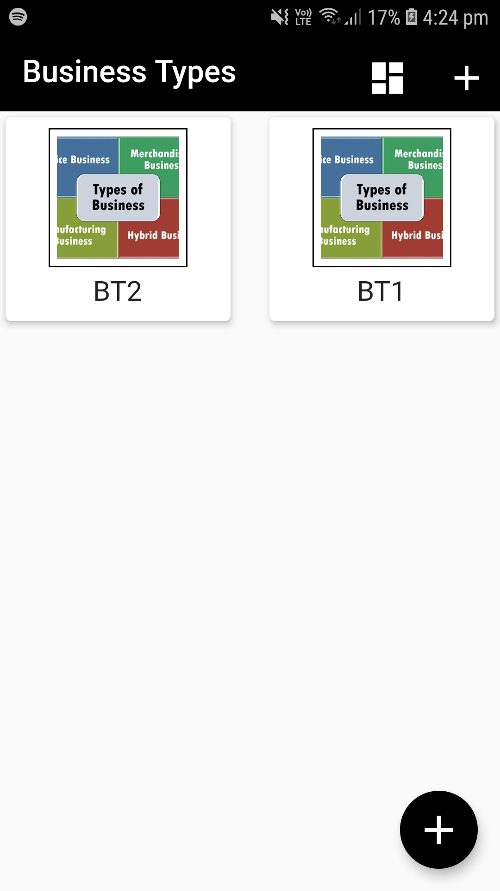
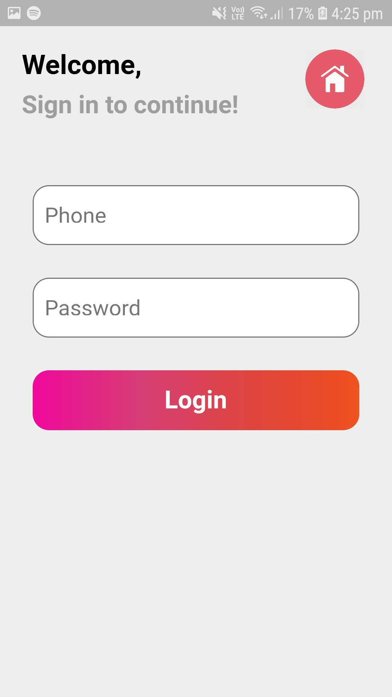
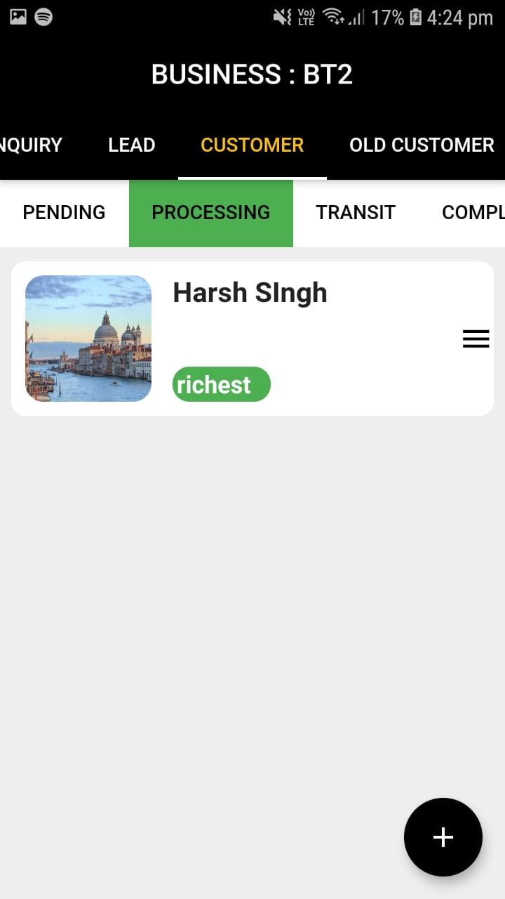

# Introduction

This project is a User App made for a an organization dealing in Water Purification System.
It helps the employees of the firm to maintain and keep record of their clients and their service status. Database used with the App is Firestore and authentication is done by manipulating Shared Preferences. For Storing images uploaded by the user Firebase Cloud Storage is used.

## Screenshots 

## Prerequisites

- Flutter SDK should be installed on the system.
- Android Studio should be installed and running.
- Device(ios or android ) should be connected to the system.

## Running The App

1. Clone the repsitory into the local System .
2. Open Command prompt into the project Directory.
3. use command "flutter run" .
4. App starts running on the connected Device.

